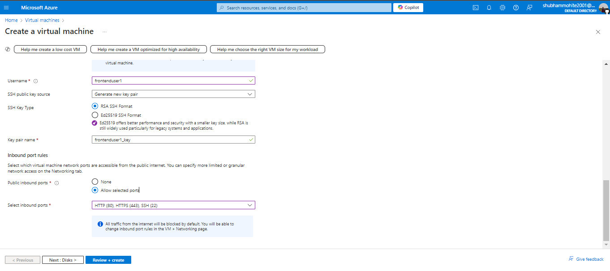
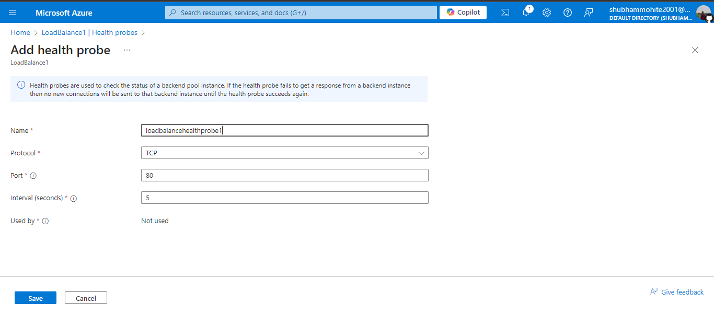

# Project: Azure Virtual Machines, Dockerized Services, MySQL, and Load Balancer

## Overview
This project demonstrates the deployment of a web application using Docker containers on Azure Virtual Machines (VMs) along with MySQL as the backend database. The setup includes front-end and back-end services running on separate VMs, containerized using Docker, and balanced through Azure's Load Balancer for improved availability and performance.

## Key Components
### Azure Virtual Machines (VMs): Linux-based VMs are used for hosting front-end and back-end services.
### Docker: Both services are containerized for portability and ease of deployment.
### MySQL Database: The backend service uses a MySQL container for database storage.
### Azure Load Balancer: Distributes traffic across multiple VMs to ensure reliable service delivery.
### Network Security Groups (NSGs): Secures the infrastructure by allowing only necessary ports to be open.

## Problem Statement
The challenge is to deploy a scalable web application architecture in a cloud environment with separate front-end and back-end services. Ensuring efficient resource management, service availability, and security while maintaining a lightweight deployment using Docker is critical to achieving a cost-effective and reliable solution.

## Project Description
In this project, two Azure VMs are set up: one for the front-end, which runs an NGINX static website, and the other for the back-end, which hosts a Node.js API server connected to a MySQL database container. The front-end serves a static HTML page, while the back-end handles API requests. Both services are containerized using Docker, allowing for easier deployment and scaling.

To ensure high availability, Azure's Load Balancer distributes incoming traffic between the VMs. Network Security Groups are configured to limit inbound traffic to only the necessary ports, providing a secure environment for the web services.

A cron job is implemented on the backend VM to monitor the health of the MySQL database and log its status at regular intervals, ensuring database uptime.

## Complete Step By Step Process :
### 1. Set Up Azure Virtual Machines
Create Front-End VM

  

Create Back-End VM

• Access Both the VM using Putty Application download if you don't have it. 
First Open Putty-gen to create a PPK file 

Open Putty and enter the IP addres of the VM to access

Then go to Connection>SSH>Auth>Credentials and browse the PPK filke saved nad Open.

### 2. Dockerize the Front-End (NGINX) Application
### 3. Dockerize the Back-End (Node.js) Application
### 4.  Deploy MySQL on Back-End VM
### 5. Set Up Azure Load Balancer
Create Load Balancer in the Azure portal

Create a frontend IP configuration.

Add both VMs (frontend and backend) to the backend pool.

Create an HTTP health probe for the front end.

Configure a load balancing rule to forward traffic from port 80 to the frontend VM.

### 6. Configure Network Security Groups (NSGs)
Create NSGs and Open Ports 80 and 443

### 7. Configure Cron Job for Database Health Check (Outputs)

### 8. Optimize VM Sizing
• Monitor VM Performance using Azure Monitor. 

• Resize VMs for cost efficiency based on resource utilization.

### LOG Files
Front-end Metrics!

Back-end Metrics!

